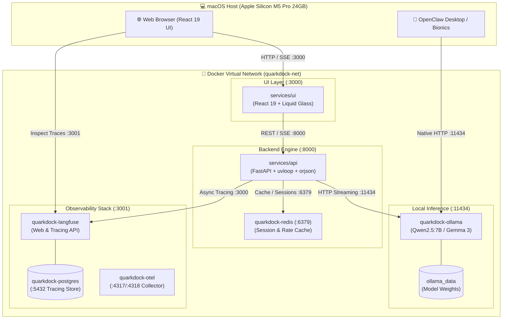

# ⚛️ QuarkDock

> **High-Performance Self-Hosted LLM Ecosystem with Full Observability & Glassmorphic Chat**  
> Engineered for Apple Silicon macOS (MacBook M5 Pro 24GB) and production-grade containerized local intelligence.

[](LICENSE)
[](https://python.org)
[](https://fastapi.tiangolo.com)
[](https://react.dev)
[](https://docker.com)
[](https://langfuse.com)
[](https://ollama.ai)

---

## 🌟 Highlights

- 🧠 **Containerized Local LLM**: Dockerized Ollama serving `qwen2.5:7b` (with Gemma 3 & Llama 3.2 support), exposed on host port `11434` for native macOS apps like **OpenClaw Desktop** and **Bionics**.
- ⚡ **High-Efficiency Backend**: Python 3.12 + FastAPI built strictly according to **Rule 09 (Python Efficiency Manifesto)** — zero-copy buffers, `__slots__`, `uvloop`, `orjson`, connection pooling, and streaming-first SSE.
- 🎨 **Next-Gen Chat Interface**: React 19 frontend crafted with modern visual paradigms: **Liquid Glass**, **macOS Acrylic / Vibrancy**, **Fluent Motion**, and **Plasma Aura** lighting.
- 🔬 **Deep Observability**: Self-hosted **Langfuse v3** stack (Postgres + Redis) tracing every token, span, latency distribution, user rating, and cost metric.
- ⚖️ **LLM-as-Judge Evaluation**: Automated evaluation harness scoring hallucination, groundedness, and helpfulness using local model-graded evals.
- 🛠️ **Single Makefile Command Center**: Control the entire container ecosystem, run evals, perform doctor checks, and execute tests with simple, unified commands.

---

## 🏛️ System Architecture



---

## 🔌 Port Mapping & Blast Radius Isolation

| Service | Container Name | Internal Port | Host Port | Purpose |
|---------|----------------|---------------|-----------|---------|
| **UI** | `quarkdock-ui` | `3000` | `3000` | Glassmorphic React 19 Chat UI |
| **API** | `quarkdock-api` | `8000` | `8000` | FastAPI Streaming Server & Proxy |
| **Ollama** | `quarkdock-ollama` | `11434` | `11434` | Local LLM Engine (Internal & Host access) |
| **Langfuse** | `quarkdock-langfuse` | `3000` | `3001` | Langfuse Web Dashboard (Host port 3001 avoids conflict) |
| **PostgreSQL**| `quarkdock-postgres` | `5432` | `5432` | Langfuse Metadata Store |
| **Redis** | `quarkdock-redis` | `6379` | `6379` | Fast Session Cache & Rate Limiting |
| **OTEL** | `quarkdock-otel` | `4317 / 4318` | `4317 / 4318` | OpenTelemetry gRPC / HTTP Collector |

---

## 📊 Hardware & Memory Allocation (24GB Host Budget)

QuarkDock is tuned to stay strictly within a **12GB – 14GB Docker memory cap** on a 24GB host, leaving ample headroom for macOS, browsers, and host desktop apps (like OpenClaw Desktop).

> 📖 **Full Sizing Guide**: See [`docs/hardware-and-resource-sizing.md`](docs/hardware-and-resource-sizing.md) for detailed CPU allocation tiers, Apple Silicon NEON vector throughput notes, and Docker Desktop VM tuning instructions.

| Container Service | Memory Limit | Memory Reservation | Storage Persistence |
|-------------------|--------------|--------------------|---------------------|
| `quarkdock-ollama` | 6.0 GB | 4.0 GB | `ollama_data` named volume |
| `quarkdock-langfuse` | 1.0 GB | 512 MB | Stateless container |
| `quarkdock-postgres` | 512 MB | 256 MB | `pg_data` named volume |
| `quarkdock-api` | 512 MB | 128 MB | Ephemeral |
| `quarkdock-ui` | 256 MB | 64 MB | Ephemeral |
| `quarkdock-redis` | 256 MB | 64 MB | `redis_data` named volume |
| `quarkdock-otel` | 128 MB | 64 MB | Ephemeral |
| **Total Ecosystem** | **~8.6 GB Max** | **~5.0 GB Steady** | **Headroom: ~3.5 – 5.0 GB in Docker** |

### Docker Desktop Sizing Requirements
- **Minimum for testing**: 10.0 GB RAM, 8 CPUs (suitable for `qwen2.5:3b` or `gemma3:4b`)
- **Recommended for production**: 12.0 – 14.0 GB RAM, 10–14 CPUs (optimal for `qwen2.5:7b-instruct-q4`)
- **Disk**: 64 GB+ (Apple Virtualization framework + VirtioFS enabled)

---

## 🚀 Quick Start

### 1. Prerequisites
- macOS Apple Silicon (M-series, 16GB+ RAM recommended, 24GB ideal)
- Docker Desktop with at least 12GB allocated
- Python 3.12+ and Node.js 20+ (for local development outside containers)

### 2. Environment Setup
```bash
git clone https://github.com/vadde/QuarkDock.git
cd QuarkDock
make setup
```

### 3. Start the Ecosystem
```bash
make dev
```

### 4. Access Services
- **Chat UI**: [http://localhost:3000](http://localhost:3000)
- **FastAPI Docs**: [http://localhost:8000/docs](http://localhost:8000/docs)
- **Langfuse Dashboard**: [http://localhost:3001](http://localhost:3001)
- **Ollama Engine**: [http://localhost:11434](http://localhost:11434) (ready for OpenClaw Desktop)

---

## ⌨️ Makefile Command Center

| Command | Action |
|---------|--------|
| `make help` | Display formatted help of all available commands |
| `make setup` | Create `.env` from template and pull base models |
| `make dev` | Start all 7 containers in the background |
| `make stop` | Stop all running containers gracefully |
| `make logs` | Tail logs across all containers with color coding |
| `make status` | Display container status, health, and memory usage |
| `make doctor` | Audit port availability, Docker status, and system resources |
| `make test` | Run unit, integration, and lint suites across services |
| `make lint` | Run Ruff on Python and ESLint on TypeScript |
| `make format` | Auto-format Python (Ruff) and TypeScript (Prettier) |
| `make eval-judge` | Run LLM-as-judge automated quality evaluations |
| `make clean` | Stop containers and remove temporary caches |

---

## 📁 Repository Structure

```
QuarkDock/
├── .agents/                    # Autonomous agent rules & guardrails
│   └── rules/                  # Rules 01-09 (including Rule 09: Python Efficiency)
├── AGENTS.md                   # Agent master operational hub
├── Makefile                    # Root command center
├── deploy/
│   └── compose/                # Docker Compose orchestration
│       ├── docker-compose.yml  # Multi-service ecosystem manifest
│       └── .env.example        # Environment variable template
├── services/
│   ├── api/                    # FastAPI backend (Python 3.12)
│   │   ├── CONTEXT.md          # Architectural context
│   │   ├── DEVLOG.md           # Engineering diary
│   │   ├── STATUS.md           # Operational status
│   │   ├── Dockerfile          # Multi-stage lightweight build
│   │   └── src/                # Modular streaming backend
│   └── ui/                     # React 19 chat frontend
│       ├── CONTEXT.md          # UI design system context
│       ├── DEVLOG.md           # UI engineering diary
│       ├── STATUS.md           # UI operational status
│       ├── Dockerfile          # Nginx static server build
│       └── src/                # Liquid glass components & state
├── specs/                      # Spec-Driven Development (SDD)
│   ├── _templates/             # Service, feature, and defect templates
│   └── catalog/                # Approved engineering specs (SPEC-001 - SPEC-004)
├── sdlc/                       # SDLC governance
│   ├── status-board.md         # Operational status of objectives & services
│   ├── ROADMAP.md              # Phased architectural milestones
│   └── CHANGELOG.md            # Semantic version release notes
├── eval/                       # LLM-as-judge evaluation benchmarks
├── docs/                       # Architectural Decision Records (ADRs)
└── scripts/                    # Maintenance & setup automation
```

---

## 📄 License

Distributed under the MIT License. See [LICENSE](LICENSE) for details.
