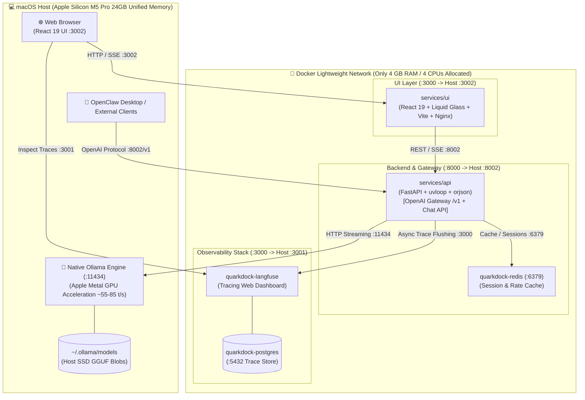

# ⚛️ QuarkDock

> **High-Performance Self-Hosted AI Ecosystem with Native Metal Acceleration, Deep Observability & Liquid Glass Chat**  
> Engineered for Apple Silicon macOS (MacBook Pro M5 Pro 24GB Unified Memory) and production-grade local intelligence.

[](LICENSE)
[](https://python.org)
[](https://fastapi.tiangolo.com)
[](https://react.dev)
[](https://docker.com)
[](https://langfuse.com)
[](https://ollama.ai)

---

## 🌟 Highlights

- ⚡ **Native Apple Silicon Metal Acceleration**: Ollama runs natively on the macOS host (`/usr/local/bin/ollama`) utilizing Unified Memory and the Metal GPU for ultra-fast **55–85 tokens/sec** inference.
- 🪶 **Drastically Downgraded Docker Footprint**: Docker Desktop requires only **4 GB RAM and 4 CPUs** (previously 14GB / 14 CPUs), freeing **20 GB RAM and 14 CPU cores** entirely for host macOS multitasking.
- 🌉 **OpenAI-Compatible Gateway with Automatic Tracing**: Unified endpoint (`/v1/chat/completions` and `/v1/models` on port `8002`) bridges external desktop clients like **OpenClaw Desktop**, Cursor, and Python scripts with automatic, zero-overhead Langfuse span tracking.
- 🎨 **Next-Gen React 19 Liquid Glass Chat**:
  - **GFM Markdown Engine**: Full GitHub Flavored Markdown rendering with syntax-highlighted code blocks, copy buttons, tables, and inline token tags.
  - **Collapsible Sessions Sidebar**: Instant toggling via header icon or global keyboard shortcut **`⌘ + B`** (`Ctrl + B`), expanding into an immersive full-width reading canvas.
  - **Draggable Quantum Navigation HUD**: Floating frosted glass capsule with Apex (`↑ Top`) and Nadir (`Latest ↓`) teleports, live generation plasma pulse radar, depth percentage (`🧭 42%`), and freeform drag-and-drop with persistent coordinates.
- 🔬 **Deep Observability Stack**: Self-hosted **Langfuse v2** on port `3001` (Postgres 16 + Redis 7) tracking every token chunk, latency distribution, user rating, and cost metric.
- 📦 **1-Click Model Orchestrator ("Manage")**: Real-time SSE streaming model installer and switcher (Qwen 2.5, Llama 3.2, Gemma 3, DeepSeek) storing weights natively on host SSD.
- ⚖️ **LLM-as-Judge Evaluation Harness**: Automated benchmarking suite (`make eval-judge`) scoring groundedness and reasoning quality.

---

## 🏛️ System Architecture



---

## 🔌 Port Mapping & Service Endpoints

| Service | Container Name | Internal Port | Host Port | Purpose | Credentials |
|---------|----------------|---------------|-----------|---------|-------------|
| **Chat UI** | `quarkdock-ui` | `3000` | `3002` | Glassmorphic React 19 Chat UI | None (Local) |
| **API & Gateway**| `quarkdock-api` | `8000` | `8002` | FastAPI Backend & OpenAI Gateway (`/v1`) | None (Local) |
| **Host Ollama** | *(Native macOS)*| — | `11434` | Apple Metal GPU LLM Engine | None (Local) |
| **Langfuse UI** | `quarkdock-langfuse` | `3000` | `3001` | Tracing & Observability Dashboard | `admin@quarkdock.local` / `quarkdock1234` |
| **PostgreSQL** | `quarkdock-postgres` | `5432` | `5432` | Langfuse Trace Database | `postgres` / `postgres` |
| **Redis** | `quarkdock-redis` | `6379` | `6379` | Fast Session Cache & Rate Limiting | None (Local) |

---

## 🖥️ Hardware Sizing: Native Hybrid vs. Containerized

Running Ollama inside Docker on macOS forces model execution onto the CPU through a virtual hypervisor, capping throughput and generating excessive heat. Moving inference to the macOS host unlocks the Metal GPU:

| Metric | Ollama in Docker (CPU) | Ollama on Host (Metal GPU) | Architecture Advantage |
|---|---|---|---|
| **Acceleration Engine** | Linux ARM NEON (CPU) | Apple Silicon Metal (GPU) | **Hardware Acceleration** |
| **Inference Speed** | ~47 tokens/sec | **55 – 85 tokens/sec** | **+20% to +80% faster** |
| **Docker RAM Needed** | 12.0 – 14.0 GB | **4.0 GB** | **Freed 20 GB RAM for host** |
| **Docker CPU Needed** | 10 – 14 CPUs | **4 CPUs** | **Freed 14 cores for host OS** |
| **Thermal / Fan Load**| High CPU thermals | **Whisper-quiet / Cool** | **Maximized battery life** |

> 📖 **Full Sizing Guide**: See [`docs/hardware-and-resource-sizing.md`](docs/hardware-and-resource-sizing.md) for detailed allocation tiers.

---

## 🧩 How the "Manage" Model Orchestrator Works

Clicking **"Manage"** in the top header opens the local Model Orchestrator modal, enabling 1-click model installation, real-time download streaming, and deletion:

```
[React 19 UI: ModelModal.tsx]
       │
       │ 1. POST /api/v1/models/pull { "name": "llama3.2:3b" }
       ▼
[FastAPI Backend: routers/models.py]
       │
       │ 2. Async HTTP Stream POST /api/pull
       ▼
[Native Host Ollama Engine: localhost:11434]
       │
       │ 3. Fetches GGUF layer blobs from registry
       │ 4. Writes model weights directly to host disk: ~/.ollama/models/
       ▼
[Real-Time Progress Streaming]
       │
       │ 5. NDJSON stream (status, completed bytes, total bytes)
       ▼
[FastAPI SSE Generator]
       │
       │ 6. SSE chunks: data: {"status": "downloading...", "completed": ..., "total": ...}
       ▼
[React 19 UI Progress Bar]
       │
       │ 7. Computes (completed / total * 100)% in real time
       │ 8. Upon [DONE], triggers GET /api/v1/models to refresh selector
```

### Key Advantages:
1. **Zero Docker Disk Bloat**: Weights are saved in `~/.ollama/models` on your host APFS storage, avoiding massive Docker virtual disk (`Docker.raw`) growth.
2. **Instant Metal Ingestion**: Once downloaded, host Ollama immediately mmap's weights directly into Apple Silicon Unified Memory without network copying.

---

## 🦾 OpenClaw & External Desktop Integration

QuarkDock provides an OpenAI-compatible gateway (`http://localhost:8002/v1`) that bridges desktop tools directly to local Apple Metal inference with automated Langfuse tracing:

- **OpenClaw Agent Wiring**: OpenClaw Desktop connects to its local gateway daemon on `ws://127.0.0.1:18789`, and the gateway's model provider points to QuarkDock's `http://localhost:8002/v1` for automatic telemetry tracking.
- **REST Clients (Chatbox, Jan, Cursor, Continue.dev)**: Point base URL directly to `http://localhost:8002/v1` with model `qwen2.5:7b`.

Every prompt sent through the gateway is automatically intercepted, routed to native Ollama via Apple Metal, and recorded in **Langfuse** on `http://localhost:3001` with complete generation spans, tokens/sec, and latency metrics.

> 📖 **Full OpenClaw Architecture Guide**: See [`docs/openclaw-desktop-integration.md`](docs/openclaw-desktop-integration.md).

---

## 🚀 Quick Start

### 1. Prerequisites
- macOS Apple Silicon (M-series, 16GB+ RAM recommended, 24GB ideal).
- Native Ollama installed on host: `brew install ollama` or downloaded from [ollama.com](https://ollama.com).
- Docker Desktop running (configured for **4 GB RAM and 4 CPUs**).

### 2. Launch Host Ollama
```bash
ollama serve
# In a separate terminal, pull your base model:
ollama run qwen2.5:7b
```

### 3. Start QuarkDock Container Ecosystem
```bash
git clone https://github.com/vadde/QuarkDock.git
cd QuarkDock
make dev
```

### 4. Access Interfaces
- **Chat UI**: [http://localhost:3002](http://localhost:3002)
- **OpenAI Gateway & Docs**: [http://localhost:8002/docs](http://localhost:8002/docs)
- **Langfuse Dashboard**: [http://localhost:3001](http://localhost:3001) (`admin@quarkdock.local` / `quarkdock1234`)

---

## ⌨️ Makefile Command Center

| Command | Action |
|---------|--------|
| `make help` | Display formatted help of all available commands |
| `make dev` | Start the QuarkDock containers in the background |
| `make stop` | Stop all running containers gracefully |
| `make logs` | Follow logs across all containers |
| `make status` | Display container health, resource consumption, and uptime |
| `make doctor` | Audit port availability, Docker status, and system resources |
| `make test` | Run unit, integration, and lint suites across services |
| `make lint` | Run Ruff on Python and ESLint on TypeScript |
| `make eval-judge` | Run automated LLM-as-judge benchmark evaluation |

---

## 📁 Repository Structure

```
QuarkDock/
├── .agents/                    # Autonomous agent rules & guardrails
│   └── rules/                  # Rules 01-10 (including Rule 10: Anti-Yes-Man Critique)
├── AGENTS.md                   # Agent master operational hub
├── Makefile                    # Root command center
├── deploy/
│   └── compose/                # Docker Compose orchestration
│       ├── docker-compose.yml  # Multi-service ecosystem manifest (5 core containers)
│       └── .env.example        # Environment variable template
├── services/
│   ├── api/                    # FastAPI backend (Python 3.12)
│   │   ├── src/                # Modular streaming backend & OpenAI gateway (/v1)
│   │   └── Dockerfile          # Multi-stage lightweight build
│   └── ui/                     # React 19 chat frontend
│       ├── src/                # Liquid glass components, Markdown, & Draggable HUD
│       └── Dockerfile          # Nginx static server build
├── specs/                      # Spec-Driven Development (SDD)
├── docs/                       # Architectural Decision Records & Guides
│   ├── hardware-and-resource-sizing.md
│   └── openclaw-desktop-integration.md
└── eval/                       # LLM-as-judge evaluation benchmarks
```

---

## 📄 License

Distributed under the MIT License. See [LICENSE](LICENSE) for details.
