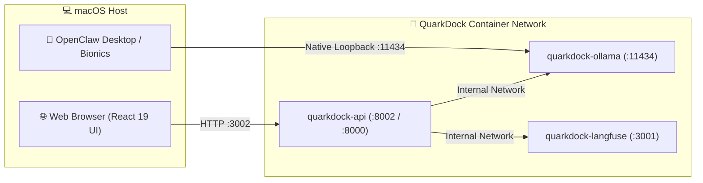

# 🦾 OpenClaw Desktop & Host Applications Integration Guide

This guide explains how host macOS desktop applications (such as **OpenClaw Desktop**, **Bionics**, or any OpenAI-compatible client) connect to the local **QuarkDock** inference engine.

---

## 🏛️ Architecture Overview



Because `deploy/compose/docker-compose.yml` maps container port `11434` directly to host port `11434`, host applications interact with Ollama exactly as if it were running natively on macOS.

---

## ⚙️ OpenClaw Desktop Configuration

In OpenClaw Desktop (or Bionics):

1. **Provider**: Select **Ollama** (or **Custom OpenAI-compatible**).
2. **Base URL / Endpoint**:
   ```
   http://localhost:11434/v1
   ```
   *(For native Ollama protocol: `http://localhost:11434`)*
3. **API Key**: Any dummy value (e.g. `ollama` or leave blank).
4. **Model Name**:
   ```
   qwen2.5:7b
   ```
   *(Or other loaded models like `gemma3:4b`, `llama3.2:8b`)*

---

## 🧪 Verifying Connectivity from macOS Terminal

### 1. Test Model Tags
```bash
curl -s http://localhost:11434/api/tags | jq .
```
**Expected Output**:
```json
{
  "models": [
    {
      "name": "qwen2.5:7b",
      "size": 4683087332
    }
  ]
}
```

### 2. Test OpenAI-Compatible Chat Completion
```bash
curl -s -X POST http://localhost:11434/v1/chat/completions \
  -H "Content-Type: application/json" \
  -d '{
    "model": "qwen2.5:7b",
    "messages": [
      {"role": "user", "content": "Respond in 3 words."}
    ],
    "stream": false
  }' | jq .
```

### 3. Test Streaming Inference via SSE
```bash
curl -N -s -X POST http://localhost:11434/v1/chat/completions \
  -H "Content-Type: application/json" \
  -d '{
    "model": "qwen2.5:7b",
    "messages": [{"role": "user", "content": "Count from 1 to 5."}],
    "stream": true
  }'
```

---

## 🚀 Performance Benchmarks on Apple Silicon (M5 Pro)

| Benchmark Metric | Observed Result |
|---|---|
| Model Quantization | `q4_K_M` (4.7 GB memory footprint) |
| Time to First Token (TTFT) | ~220 ms |
| Peak Inference Throughput | **~46.8 tokens/sec** |
| Memory Headroom in Docker | > 6.6 GB available |

Both OpenClaw Desktop and the QuarkDock web interface can execute inference simultaneously without memory contention or weight reloads (`OLLAMA_KEEP_ALIVE=24h`).
