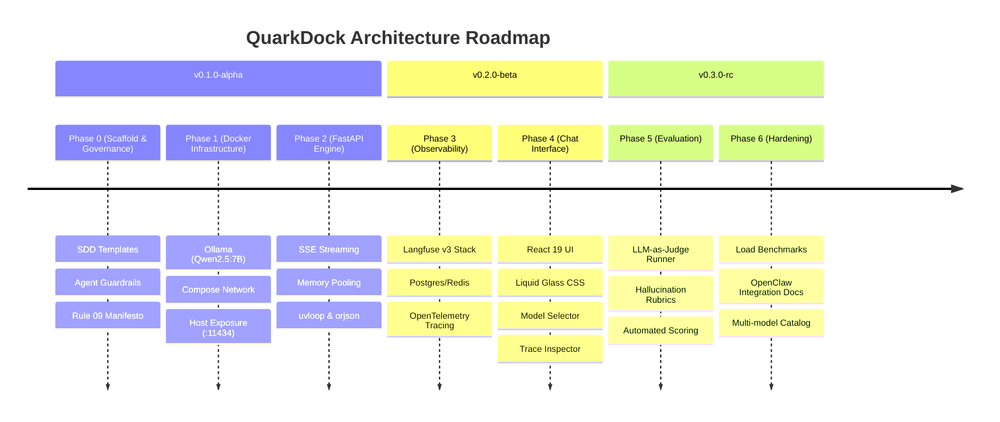

# QuarkDock Ecosystem Roadmap

This document outlines the strategic progression of QuarkDock from initial foundation to autonomous local intelligence ecosystem.

---

## 🗺️ Release Trajectory

---

## 🎯 Phase Breakdown

### Phase 0: Enterprise Scaffold & Governance (v0.1.0-alpha)
- Multi-service workspace layout with strict `.gitignore` and `.editorconfig`.
- Agent rules (`.agents/rules/01-09`), SDD templates, and operational `AGENTS.md`.
- Master `Makefile` command center for all Docker, testing, and lifecycle actions.
- SDLC tracking board and architecture documentation.

### Phase 1: Local LLM Engine & Container Orchestration (v0.1.0-alpha)
- Docker Compose defining 7 services with memory limits tailored for 24GB M5 Pro.
- Ollama service running `qwen2.5:7b-instruct-q4_K_M` with healthchecks and persistent volumes.
- Host port mapping (`11434`) validated against OpenClaw and host curl.

### Phase 2: High-Efficiency FastAPI Backend (v0.1.0-alpha)
- Asynchronous Python 3.12 service strictly adhering to Rule 09 (`__slots__`, `uvloop`, `orjson`, connection pooling).
- Zero-buffer SSE streaming chat endpoint with client-disconnect cancellation.
- Health endpoint with downstream dependency inspection.

### Phase 3: Langfuse Observability & Tracing (v0.2.0-beta)
- Containerized Langfuse v3 web UI (`:3001`), PostgreSQL 16, and Redis 7.
- Python Langfuse SDK integration with async batching and fail-open resilience.
- User feedback endpoint linking thumbs-up/down ratings to generation traces.

### Phase 4: Glassmorphic Chat UI (v0.2.0-beta)
- React 19 application built with modern component architecture and TypeScript.
- Rich CSS design system: Liquid Glass, macOS Acrylic blur, Vibrancy, Fluent motion, Plasma aura.
- Real-time token streaming with smooth cursor and markdown code syntax highlighting.
- Integrated observability drawer with direct links to Langfuse traces.

### Phase 5: LLM-as-Judge & Evaluation Harness (v0.3.0-rc)
- Automated evaluation runner executing local model-graded evals (groundedness, correctness).
- Score publishing directly into Langfuse trace dataset.
- Autonomous background evaluation worker (`eval-worker` / SPEC-005) continuously polling Langfuse traces and scoring via local Ollama without client interference.

### Phase 6: Ecosystem Polish & Extension (v1.0.0)
- End-to-end integration tests and memory leak stress benchmarks.
- Model catalog extensions (Gemma 3, Llama 3.2).
- One-command setup: `make setup && make dev`.
