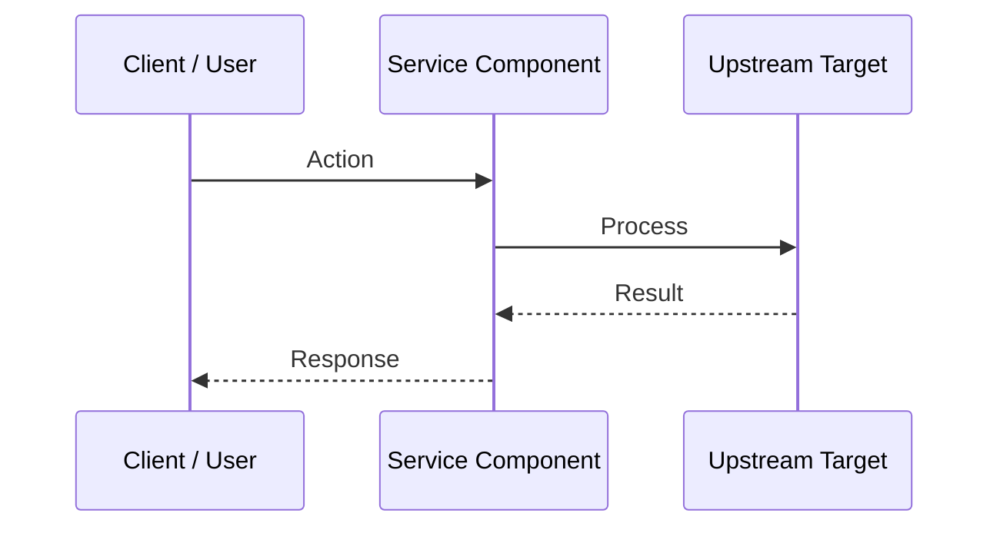

# Feature Specification: [Feature Name]

- **Spec ID**: SPEC-XXX
- **Target Service**: [api | ui | infra | eval]
- **Status**: [DRAFT | PLANNED | IN_PROGRESS | REVIEW | VERIFIED | DONE]
- **Owner**: [Agent / Contributor]
- **Last Updated**: YYYY-MM-DD

---

## 1. Problem Statement & User Value
Clear description of the feature, the problem it solves, and the expected user experience.

## 2. Technical Architecture & Data Flow

## 3. Detailed Interface Changes
- New API routes, SSE event types, or UI components.
- Request/response payload examples.

## 4. Performance & Memory Impact (Rule 09 Check)
- Memory allocation analysis.
- Latency and throughput considerations.

## 5. Acceptance Criteria
- [ ] Automated unit test covering happy path.
- [ ] Automated test covering error/failure path.
- [ ] Visual or end-to-end verification step.
