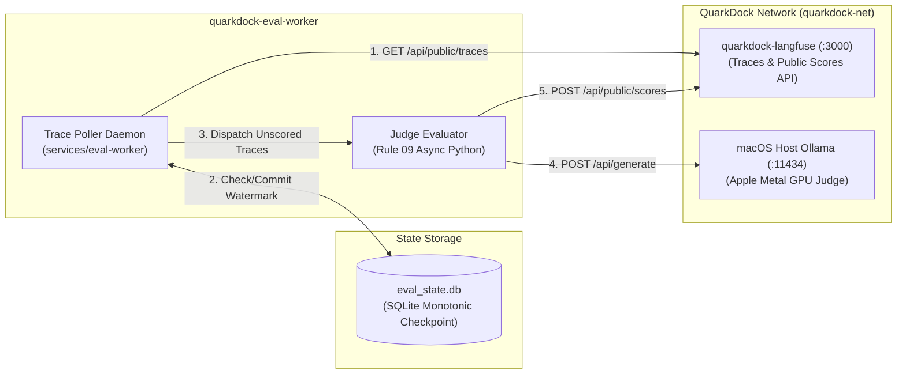

# Service Specification: Automated LLM-as-Judge Evaluation Worker (`eval-worker`)

- **Spec ID**: SPEC-005
- **Status**: DRAFT
- **Owner**: QuarkDock Core Architecture & Observability
- **Last Updated**: 2026-09-30

---

## 1. Overview & Purpose
The `eval-worker` is a decoupled, autonomous background service that adjudicates generation quality across the QuarkDock ecosystem without modifying client-side applications (Chat UI, OpenClaw Desktop, external API consumers). 

Because Langfuse Open Source (OSS) gates server-side UI-managed LLM judge configurations behind Enterprise entitlements, `eval-worker` fulfills this mission externally:
1. Continuously discovers new generation traces via the Langfuse Public REST API.
2. Identifies unevaluated chat interactions.
3. Evaluates prompt/response pairs against standardized rubrics (`correctness`, `conciseness`, `helpfulness`) using the host Apple Silicon Metal-accelerated Ollama engine.
4. Ingests normalized numeric scores and judge rationales back into Langfuse via `POST /api/public/scores`.

---

## 2. Architectural Boundaries & Dependencies



- **Container Name**: `quarkdock-eval-worker`
- **Internal Network**: `quarkdock-net`
- **Port Bindings**: None required externally. Operates as an internal background processing daemon.
- **Upstream Dependencies**:
  - `quarkdock-langfuse` (`http://langfuse:3000` via public REST API with Basic Auth `pk-lf-...` / `sk-lf-...`)
  - `ollama` (`http://host.docker.internal:11434` / Metal GPU)
- **Downstream Consumers**:
  - None directly. Langfuse UI displays the ingested scores and comments on the trace inspection view.
- **Persistent Storage**:
  - `eval_data` named Docker volume mounted at `/data` (persists SQLite state watermark DB `eval_state.db`).

---

## 3. Resource Budget (MacBook M5 Pro Allocation)

- **Memory Limit**: 256 MB (enforced in `docker-compose.yml`)
- **Memory Reservation**: 64 MB
- **CPU Allocation**: 0.5 CPU core limit
- **Polling Interval**: Configurable via `EVAL_WORKER_POLL_INTERVAL_SEC` (default: `15s`)
- **Concurrency & Batching**: Max `5` concurrent evaluations per tick to prevent starving host GPU inference during active user chat sessions.
- **Timeouts**:
  - Langfuse API calls: 10.0s connection / read timeout
  - Ollama Judge generation: 60.0s timeout per rubric evaluation

---

## 4. Interface Contracts

### 4.1 Langfuse Trace Ingestion Inspection
- **Endpoint**: `GET /api/public/traces?page=1&limit=20&orderBy=timestamp&order=desc`
- **Headers**: `Authorization: Basic <base64(public_key:secret_key)>`
- **Filtering Logic**:
  - Check whether `output` or generation spans exist.
  - Check whether target rubric scores (e.g. `judge_correctness`, `judge_conciseness`, `judge_helpfulness`) are already present in `scores` array.
  - Filter out traces already completed in local SQLite watermark cache.

### 4.2 Ollama Judge Invocations
- **Endpoint**: `POST /api/generate`
- **Payload**:
  ```json
  {
    "model": "qwen2.5:7b",
    "prompt": "<interpolated rubric prompt with query and response>",
    "stream": false,
    "options": {
      "temperature": 0.0
    }
  }
  ```
- **Rubrics**: Conforms to `eval/rubrics.py` templates (`CORRECTNESS`, `CONCISENESS`, `HELPFULNESS`).

### 4.3 Langfuse Score Submission
- **Endpoint**: `POST /api/public/scores`
- **Headers**: `Authorization: Basic <base64(public_key:secret_key)>`, `Content-Type: application/json`
- **Payload**:
  ```json
  {
    "traceId": "<trace_id>",
    "name": "judge_correctness",
    "value": 0.8,
    "comment": "Score: 4/5. Rationale: Accurate explanations with minor syntax caveat."
  }
  ```

---

## 5. Failure Modes & Fallback Behavior

1. **Langfuse Offline or Unreachable**:
   - Worker logs warning, backs off exponentially (5s -> 10s -> 30s -> max 60s), and does not advance the state watermark.
2. **Ollama Offline or Evicted**:
   - If Ollama fails or times out, evaluation for that specific trace is retried up to 3 times before being quarantined into a dead-letter state in SQLite, preventing permanent worker stalls.
3. **No Unbounded Memory Growth**:
   - Follows Rule 09 (`__slots__`, streaming response handling, lightweight SQLite connection lifecycle).
4. **Idempotency & Double-Scoring Protection**:
   - Composite primary key in local SQLite database: `(trace_id, rubric_name)`.
   - Secondary check: In-flight check of trace `scores` array from Langfuse API response before issuing Ollama call.

---

## 6. Acceptance Criteria

- [ ] **SPEC-005 Definition**: Approved and placed in `specs/catalog/`.
- [ ] **Daemon Execution**: Worker runs continuously in Docker container or standalone Python CLI without memory leaks.
- [ ] **Decoupled Evaluation**: Traces generated by UI chat or OpenClaw are automatically scored without client-side intervention.
- [ ] **Observability Verification**: Ingested scores (`judge_correctness`, `judge_conciseness`, `judge_helpfulness`) appear on the Langfuse UI (`:3001`) under the corresponding trace details.
- [ ] **State Durability**: Restarting the worker container resumes from the last watermark without re-scoring historical traces.
- [ ] **Resource Compliance**: Worker container memory stays below 100 MB under normal polling operation.
